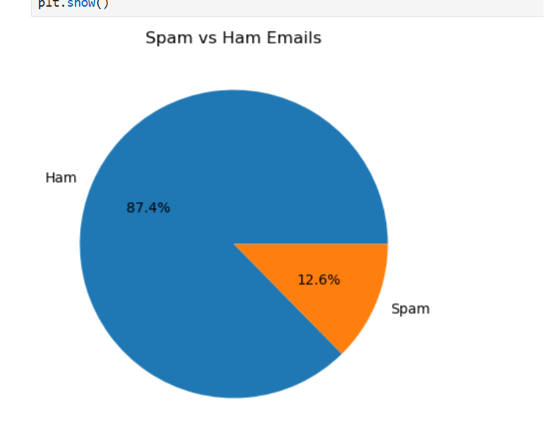
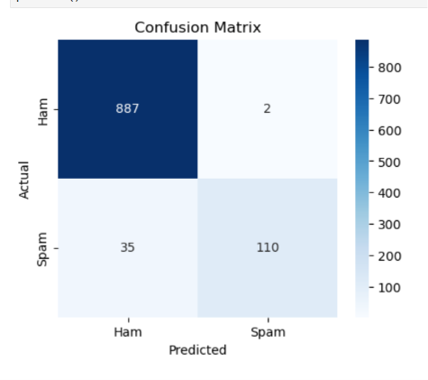

# Stuti_Task-4
Spam message classification using Python and machine learning.

# Spam Message Classification

## Task Information
- **Task Number:** Task 4
- **Project Name:** Spam Message Classification
- **Author:** Stuti Bakrania

---

## Project Objective
The objective of this project is to classify SMS messages as spam or ham using machine learning techniques in Python.

---

## Dataset Used
- Spam_Dataset.csv

The dataset contains:
- SMS messages
- Message labels (Spam or Ham)

---

## Technologies & Libraries Used
- Python
- Pandas
- NumPy
- Matplotlib
- Seaborn
- Scikit-learn

---

## Project Workflow
1. Importing required libraries
2. Loading dataset
3. Data preprocessing
4. Text cleaning
5. Feature extraction
6. Model training
7. Prediction and evaluation

---

## Files Included
- `Stuti_Task4.ipynb`
- `Spam_Dataset.csv`
- `README.md`
- 
- 

---

## Output
The machine learning model classifies SMS messages as spam or non-spam (ham).

---

## Output Screenshot

